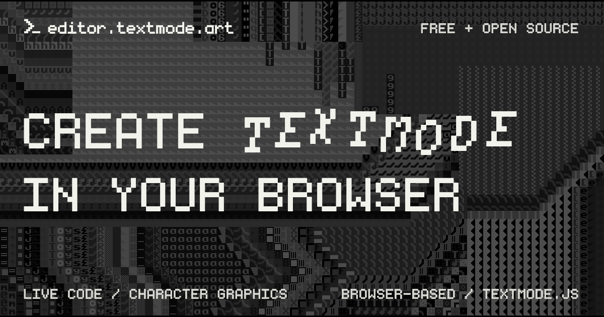

# textmode.overlay.js

|   |    |   |
|:---|:---|:---|

`textmode.overlay.js` is the official target-overlay add-on for [`textmode.js`](https://github.com/humanbydefinition/textmode.js), giving a live canvas or video element a textmode twin. The output canvas renders directly on top of the target and stays pinned there through resizes, scrolling, and window changes — so the textmode view tracks the element as the page moves.

Bind a target once with `t.overlay.setTarget()`, then sample it with the same character, color, conversion, and transform settings as any other source. Show, hide, or toggle the overlay independently while drawing continues, retarget freely between elements, or leave a target detached until it mounts - the add-on owns the geometry and DOM lifecycle so you can focus on the composition.

## Features

- **Synchronous target binding** - `setTarget()` runs immediately after `textmode.create()` and returns a fully configurable `TextmodeTexture`
- **Live canvas and video sampling** - Sample HTMLCanvasElement or HTMLVideoElement targets through the standard character, color, conversion, and transform settings
- **Frame-coalesced geometry sync** - Target resize, captured scroll, window resize, video metadata, and post-draw notifications settle into one animation frame
- **DOM lifecycle ownership** - Clearing or uninstalling the plugin restores the output canvas to its original DOM location and modified inline styles
- **Disconnected-target watching** - Targets are watched until they are mounted into the document
- **Output visibility controls** - Show, hide, and toggle only the output canvas while sampling and sketch execution continue
- **Axis-aligned positioning** - Rotated or skewed CSS targets are rejected rather than approximated

## Installation

Follow the [official installation guide](https://code.textmode.art/docs/installation) to install
`textmode.overlay.js` alongside `textmode.js` with npm or browser-ready UMD bundles.

## Next steps

- **[Read the documentation](https://code.textmode.art/)** for core concepts and plugin workflows.
- **[Browse the API reference](https://code.textmode.art/api/textmode.overlay.js/)** for the complete controller and plugin API.
- **[Explore the examples](./examples/)** to see canvas, video, retargeting, and visibility patterns in action.

## Contributing

Thank you for considering contributing to this project! (✿◠‿◠)

Please read the [Contributing Guide](./CONTRIBUTING.md) to get started.

<!-- TEXTMODE-CONTRIBUTORS:START -->
<!-- prettier-ignore-start -->
<!-- Generated from https://github.com/humanbydefinition/code.textmode.art/blob/main/.vitepress/data/contributors.json and https://github.com/humanbydefinition/code.textmode.art/blob/main/.vitepress/data/contribution-types.json. Do not edit this section directly. -->
## Contributors

Thanks to the people who contribute code, documentation, design, examples, ideas, infrastructure, and care
across the textmode.js ecosystem.

<!-- markdownlint-disable MD033 -->
<table>
  <tbody>
    <tr>
      <td align="center" valign="top" width="14.28%">
        <a href="https://github.com/humanbydefinition">
          
           <b>humanbydefinition</b>
        </a>
         💻 📖 🎨 💡 🤔 🚧 🚇 🔧 🔌 👀
      </td>
      <td align="center" valign="top" width="14.28%">
        <a href="https://github.com/trintlermint">
          
           <b>trintlermint</b>
        </a>
         🎨 💡
      </td>
    </tr>
  </tbody>
</table>
<!-- markdownlint-enable MD033 -->

Contribution details and profile links are maintained on the [textmode.js contributors page](https://code.textmode.art/docs/contributors).
<!-- prettier-ignore-end -->
<!-- TEXTMODE-CONTRIBUTORS:END -->

## License

`textmode.overlay.js` is licensed under the [MIT License](./LICENSE).
